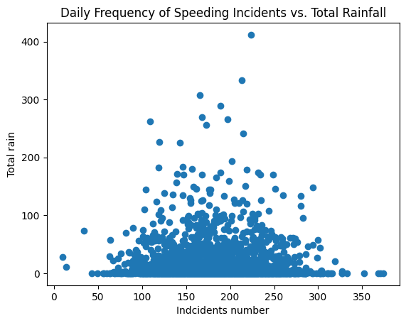
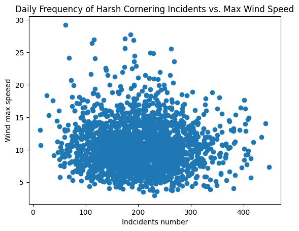

```python
import psycopg2


```


```python
def connect_to_database():
    db_params = {
    'host': '194.171.191.226',
    'port': '6379',
    'database': 'postgres',
    'user': 'group6',
    'password': 'blockd_2024group6_79'
    }
    try:
        conn_psycopg2 = psycopg2.connect(**db_params)
        print('Connection was successful!')
        return conn_psycopg2
    except Exception as e:
        print('Connection was not successful!')
        print(e)

    
```


```python

def create_cursor(connection):
    return connection.cursor()

def close_cursor(cursor):
    cursor.close()

def close_connection(connection):
    connection.close()
```


```python

```


```python
def init_database_connection(func):
    
    
    
    def wrapper(*args):
        connection = connect_to_database()

        cursor = create_cursor(connection)
        res =func(cursor ,*args)

        close_cursor(cursor)
        close_connection(connection)
        return res

    return wrapper
```


```python
@init_database_connection
def show_select_query_results(cursor, query):
   
    cursor.execute(query)
    rows = cursor.fetchall()
    print('Results are here' ,rows )
    for row in rows:
        print(row)
    
    return rows
    
```


```python

def get_column_names(table_name):
        q = f'''
    SELECT COLUMN_NAME
    FROM information_schema.columns
    WHERE table_schema ='data_lake'
    AND table_name ='{table_name}'
    ORDER BY ordinal_position
    '''
        show_select_query_results(q)
    
```


```python


test_query = '''
 SELECT * FROM data_lake.safe_driving
 LIMIT 10;

'''

show_select_query_results( test_query)
```

Section 1
Answering these questions will demonstrate Poor and Insufficient criteria.

Let's get a feel for our data and look at some basic metrics of interest.

1.1 How many event categories are in the database?
1.2 On which date were there the most incidents of speeding?
1.3 On which date were there the most incidents of hard braking?
1.4 Which road name has the highest average speed for speeding incidents?
1.5 Which road name has the highest average speed for speeding incidents where more than 5 total incidents have occured?


```python
# 1.1 How many event categories are in the database?
# This query counts the number of unique event categories in the 'safe_driving' table.
query_1_1 = '''
SELECT COUNT(DISTINCT category)
FROM data_lake.safe_driving
'''
# Executes the query and prints the result which shows the count of distinct event categories.
show_select_query_results(query_1_1)
### There are eight event categories
```

    Connection was successful!
    Results are here [(8,)]
    (8,)


    [(8,)]


```python

query = '''
SELECT  DISTINCT category
FROM data_lake.safe_driving
'''

show_select_query_results(query)
```

    Connection was successful!
    Results are here [('ACCELERATING',), ('ACCELERATING    ',), ('BRAKING',), ('BRAKING         ',), ('HARSH CORNERING',), ('HARSH CORNERING ',), ('SPEED',), ('SPEED           ',)]
    ('ACCELERATING',)
    ('ACCELERATING    ',)
    ('BRAKING',)
    ('BRAKING         ',)
    ('HARSH CORNERING',)
    ('HARSH CORNERING ',)
    ('SPEED',)
    ('SPEED           ',)


    [('ACCELERATING',),
     ('ACCELERATING    ',),
     ('BRAKING',),
     ('BRAKING         ',),
     ('HARSH CORNERING',),
     ('HARSH CORNERING ',),
     ('SPEED',),
     ('SPEED           ',)]


```python
# 1.2 On which date were there the most incidents of speeding?
query_1_2 = '''
SELECT  DATE(event_start) AS date_only, COUNT(category) AS speeding_incident
FROM data_lake.safe_driving
WHERE category  LIKE 'SPEED%'
GROUP BY date_only 
ORDER BY speeding_incident DESC
LIMIT 1;

'''

show_select_query_results(query_1_2)
## On this day  (datetime.date(2023, 3, 2), 374)

```

    Connection was successful!
    Results are here [(datetime.date(2023, 3, 2), 374)]
    (datetime.date(2023, 3, 2), 374)


    [(datetime.date(2023, 3, 2), 374)]


```python
# 1.3 On which date were there the most incidents of hard braking?

query_1_3 = '''
SELECT DATE(event_start) AS date_only , COUNT(category) AS braking_incident
FROM data_lake.safe_driving
WHERE category LIKE 'BRAKING%'
GROUP BY date_only
ORDER BY braking_incident DESC
LIMIT 1;

'''

show_select_query_results(query_1_3)
## On this day  (datetime.date(2021, 7, 23), 225)
```

    Connection was successful!
    Results are here [(datetime.date(2021, 7, 23), 225)]
    (datetime.date(2021, 7, 23), 225)


    [(datetime.date(2021, 7, 23), 225)]


```python
# 1.4 Which road name has the highest average speed for speeding incidents?

query_1_4 = '''
SELECT road_name, AVG(maxwaarde) AS avg_speed
FROM data_lake.safe_driving
WHERE category LIKE 'SPEED%'
GROUP BY road_name
ORDER BY avg_speed DESC
LIMIT 1;


'''
show_select_query_results(query_1_4)
## ('De Asdreef', 214.27235412597656)
```

    Connection was successful!
    Results are here [('De Asdreef', 214.27235412597656)]
    ('De Asdreef', 214.27235412597656)


    [('De Asdreef', 214.27235412597656)]


```python
# 1.5 Which road name has the highest average speed for speeding incidents where more than 5 total incidents have occured?


query_1_5 = '''

SELECT road_name, AVG(maxwaarde) AS avg_speed 
FROM data_lake.safe_driving
WHERE category LIKE 'SPEED%' 

GROUP BY road_name
HAVING COUNT(*) > 5
ORDER BY avg_speed DESC
LIMIT 1;

'''

show_select_query_results(query_1_5)
## ('Luikstraat', 185.97097524007162)
```

    Connection was successful!
    Results are here [('Luikstraat', 185.97097524007162)]
    ('Luikstraat', 185.97097524007162)


    [('Luikstraat', 185.97097524007162)]


Section 2

2.1 Find the instance of Hard Braking where the highest G-Force was recorded. If there are multiple instances of the same G-Force chose the event with the largest difference in starting speed to ending speed.


```python

query_2_1 = '''
SELECT eventid ,  maxwaarde AS g_force , ABS(speed_kmh - end_speed_kmh) AS speed_difference  , event_start
FROM data_lake.safe_driving
WHERE category LIKE 'BRAKING%'
ORDER BY g_force DESC,    speed_difference DESC
LIMIT 1;
'''

show_select_query_results(query_2_1)
#(122613793, 10.18232, 1.227603)
```

    Connection was successful!
    Results are here [(122613793, 10.18232, 1.227603, datetime.datetime(2023, 9, 2, 15, 59, 54, 400000))]
    (122613793, 10.18232, 1.227603, datetime.datetime(2023, 9, 2, 15, 59, 54, 400000))


    [(122613793,
      10.18232,
      1.227603,
      datetime.datetime(2023, 9, 2, 15, 59, 54, 400000))]


2.2 Did it rain in the hour before this incident?


```python
get_column_names('precipitation')
```

    Connection was successful!
    Results are here [('dtg',), ('LOCATION',), ('NAME',), ('latitude',), ('longitude',), ('altitude',), ('dr_pws_10',), ('dr_regenm_10',), ('ww_cor_10',), ('ri_pws_10',), ('ri_regenm_10',)]
    ('dtg',)
    ('LOCATION',)
    ('NAME',)
    ('latitude',)
    ('longitude',)
    ('altitude',)
    ('dr_pws_10',)
    ('dr_regenm_10',)
    ('ww_cor_10',)
    ('ri_pws_10',)
    ('ri_regenm_10',)


```python
get_column_names('safe_driving')
```

    Connection was successful!
    Results are here [('eventid',), ('event_start',), ('event_end',), ('duration_seconds',), ('latitude',), ('longitude',), ('speed_kmh',), ('end_speed_kmh',), ('maxwaarde',), ('category',), ('incident_severity',), ('is_valid',), ('road_segment_id',), ('road_manager_type',), ('road_number',), ('road_name',), ('place_name',), ('municipality_name',), ('road_manager_name',)]
    ('eventid',)
    ('event_start',)
    ('event_end',)
    ('duration_seconds',)
    ('latitude',)
    ('longitude',)
    ('speed_kmh',)
    ('end_speed_kmh',)
    ('maxwaarde',)
    ('category',)
    ('incident_severity',)
    ('is_valid',)
    ('road_segment_id',)
    ('road_manager_type',)
    ('road_number',)
    ('road_name',)
    ('place_name',)
    ('municipality_name',)
    ('road_manager_name',)


```python


query_2_2 = '''
SELECT RI_PWS_10, dtg
FROM data_lake.precipitation
WHERE dtg BETWEEN 
(SELECT event_start - INTERVAL '1 hour' 
FROM (
SELECT eventid ,  maxwaarde AS g_force , ABS(speed_kmh - end_speed_kmh) AS speed_difference  , event_start
FROM data_lake.safe_driving
WHERE category LIKE 'BRAKING%'
ORDER BY g_force DESC,    speed_difference DESC
LIMIT 1

))
AND (SELECT event_start 
FROM (
SELECT eventid ,  maxwaarde AS g_force , ABS(speed_kmh - end_speed_kmh) AS speed_difference  , event_start
FROM data_lake.safe_driving
WHERE category LIKE 'BRAKING%'
ORDER BY g_force DESC,    speed_difference DESC
LIMIT 1


));

'''


show_select_query_results(query_2_2)

## No, it did not rain  
# (0.0, datetime.datetime(2023, 9, 2, 15, 0))
# (0.0, datetime.datetime(2023, 9, 2, 15, 10))
# (0.0, datetime.datetime(2023, 9, 2, 15, 20))
# (0.0, datetime.datetime(2023, 9, 2, 15, 30))
# (0.0, datetime.datetime(2023, 9, 2, 15, 40))
# (0.0, datetime.datetime(2023, 9, 2, 15, 50))
```

    Connection was successful!
    Results are here [(0.0, datetime.datetime(2023, 9, 2, 15, 0)), (0.0, datetime.datetime(2023, 9, 2, 15, 10)), (0.0, datetime.datetime(2023, 9, 2, 15, 20)), (0.0, datetime.datetime(2023, 9, 2, 15, 30)), (0.0, datetime.datetime(2023, 9, 2, 15, 40)), (0.0, datetime.datetime(2023, 9, 2, 15, 50))]
    (0.0, datetime.datetime(2023, 9, 2, 15, 0))
    (0.0, datetime.datetime(2023, 9, 2, 15, 10))
    (0.0, datetime.datetime(2023, 9, 2, 15, 20))
    (0.0, datetime.datetime(2023, 9, 2, 15, 30))
    (0.0, datetime.datetime(2023, 9, 2, 15, 40))
    (0.0, datetime.datetime(2023, 9, 2, 15, 50))


    [(0.0, datetime.datetime(2023, 9, 2, 15, 0)),
     (0.0, datetime.datetime(2023, 9, 2, 15, 10)),
     (0.0, datetime.datetime(2023, 9, 2, 15, 20)),
     (0.0, datetime.datetime(2023, 9, 2, 15, 30)),
     (0.0, datetime.datetime(2023, 9, 2, 15, 40)),
     (0.0, datetime.datetime(2023, 9, 2, 15, 50))]


2.3 What was the weather like on the day when there were the most speeding incidents? (Calculate Min and Max temperatures, total rain fall, average wind speed)


```python
query_2_3 = '''

SELECT  MIN(t.T_DRYB_10) AS min_temp , MAX(t.T_DRYB_10) AS max_temp , 
SUM(p.RI_PWS_10) AS total_rain_fall , 
AVG(w.FF_SENSOR_10) AS avg_wind_speed

FROM data_lake.temperature as t
INNER JOIN data_lake.wind AS w
USING(dtg)
INNER JOIN data_lake.precipitation as p
USING (dtg)
WHERE w.dtg::date =  (

SELECT  event_start_date::date
FROM (
SELECT 
    DATE(event_start) as event_start_date  , 
    COUNT(*) AS indcidents_num
FROM data_lake.safe_driving
WHERE category LIKE 'SPEED%'
 GROUP by event_start_date
 ORDER BY indcidents_num DESC
LIMIT 1))


'''

show_select_query_results(query_2_3)


# (-2.7, 10.0, 0.0, 5.939305590258704)  ##  Min temp, max tempt, total rainfall, avg_wind_speed
```

    Connection was successful!
    Results are here [(-2.7, 10.0, 0.0, 5.939305590258704)]
    (-2.7, 10.0, 0.0, 5.939305590258704)


    [(-2.7, 10.0, 0.0, 5.939305590258704)]


Section 3

3.1 Plot the frequency of speeding incidents against the daily total rainfall.
3.2 Plot the frequency of Harsh Cornering incidents against daily maximum windspeed.

3.1 Plot the frequency of speeding incidents against the daily total rainfall.


```python
query_3_1 = '''

SELECT sd.indcidents_num, p.total_rain  
FROM (
SELECT 
    DATE(event_start) as event_start_date  , 
    COUNT(*) AS indcidents_num
    FROM data_lake.safe_driving
    WHERE category LIKE 'SPEED%'
    GROUP BY event_start_date
    
) AS sd, 
(
SELECT SUM(RI_PWS_10) AS total_rain,  DATE(dtg) AS rain_date 
FROM data_lake.precipitation
GROUP BY rain_date

) AS p
WHERE sd.event_start_date = p.rain_date 


'''


res_3_1 = show_select_query_results(query_3_1)

```


```python
res_3_1 = [[i for i,j in res_3_1],
           [j for i,j in res_3_1]]
```


```python


import matplotlib.pyplot as plt
def plot_3_1_results(x,  y ):
    fig,ax = plt.subplots()

    print(ax)
    ax.scatter( x , y )

    ax.set_xlabel('Indcidents number')
    ax.set_ylabel('Total rain')
    ax.set_title('Daily Frequency of Speeding Incidents vs. Total Rainfall')
    plt.show()


```


```python
plot_3_1_results(res_3_1[0], res_3_1[1])
```

    Axes(0.125,0.11;0.775x0.77)


    

    


3.2 Plot the frequency of Harsh Cornering incidents against daily maximum windspeed.


```python
query_s = '''
SELECT DISTINCT category
FROM data_lake.safe_driving

'''

show_select_query_results(query_s)
```

    Connection was successful!
    Results are here [('ACCELERATING',), ('ACCELERATING    ',), ('BRAKING',), ('BRAKING         ',), ('HARSH CORNERING',), ('HARSH CORNERING ',), ('SPEED',), ('SPEED           ',)]
    ('ACCELERATING',)
    ('ACCELERATING    ',)
    ('BRAKING',)
    ('BRAKING         ',)
    ('HARSH CORNERING',)
    ('HARSH CORNERING ',)
    ('SPEED',)
    ('SPEED           ',)


    [('ACCELERATING',),
     ('ACCELERATING    ',),
     ('BRAKING',),
     ('BRAKING         ',),
     ('HARSH CORNERING',),
     ('HARSH CORNERING ',),
     ('SPEED',),
     ('SPEED           ',)]


```python
query_3_2 = '''

SELECT sd.indcidents_num, w.wind_max_speed  
FROM (
SELECT 
    DATE(event_start) as event_start_date  , 
    COUNT(*) AS indcidents_num
    FROM data_lake.safe_driving
    WHERE category  LIKE 'HARSH CORNERING%'
    GROUP BY event_start_date
    
) AS sd, 
(
SELECT DATE(dtg) AS wind_date  , MAX(FF_SENSOR_10) AS wind_max_speed  
FROM data_lake.wind
GROUP BY wind_date

) AS w
WHERE sd.event_start_date = w.wind_date 


'''


res_3_2 = show_select_query_results(query_3_2)
```


```python
res_3_2 = [[i for i,j in res_3_2],
           [j for i,j in res_3_2]]
```


```python


def plot_3_2_results(x,  y ):
    fig,ax = plt.subplots()

    print(ax)
    ax.scatter( x , y )

    ax.set_xlabel('Indcidents number')
    ax.set_ylabel('Wind max speeed')
    ax.set_title('Daily Frequency of Harsh Cornering Incidents vs. Max Wind Speed')

    plt.show()
```


```python
plot_3_2_results(res_3_2[0],res_3_2[1])
```

    Axes(0.125,0.11;0.775x0.77)


    

    


```python

```
